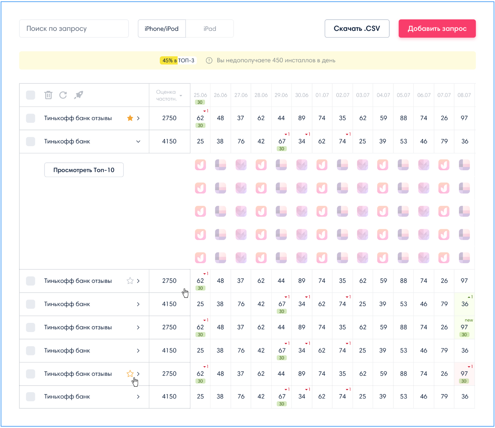

# Тестовое задание: html-верстальщик

Сверстайте макет:

  

Для вёртки используйте [проект в Фигме]() (доступен без инвайтов) или [проект в zeplin](https://zpl.io/bljyX4X) (напишите на почту asubbotin@appbooster.ru для получения инвайта в проект. В теме письма укажите "Запрос на тестовое задание: html-верстальщик")

## Требования:

* Адаптивная вёрстка. Поддерживаются как большие 4К дисплеи, так и телефоны. Главный критерий - работоспособность и доступность.
* Первые 2 колонки таблицы должны быть зафиксированы.  Далее может быть любое количество колонок - они должны скроллиться
* Используйте пре/пост процессоры для написания CSS
* Если каких-то элементов не хватает в дизайне - придумайте, как они могут выглядеть и реализуйте их.

## Пожелания

* Используйте сборщики для минимизации html/css
* Добавьте немного JS:
  * Пользователь может нажать на checkbox вверху страницы для измеения выбора (выбраны все строки / не выбрана ни одна строка)
  * Пользователь может навести курсор на иконку в развёртнутой строке таблицы для подсвечивани этой же иконки в другие дни.
* Выложите готовую вёрстку на публично доступный адрес
