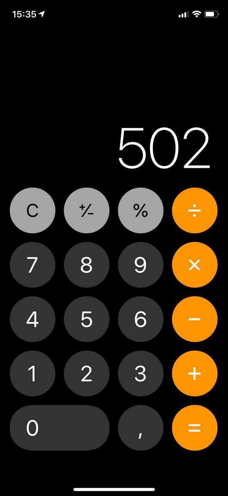

# Тестовое задание: react native

Используя React Native создайте простейшее мобильное приложение-калькулятор. Возьмите за основу стандартное приложение-калькулятор на iOS, но сделайте его немного проще. Выполняйте задачу по шагам:

1. Свертайте основной экран калькулятора:

  

2. Реализуйте логику нажатия на цифры. Возьмите за основу поведение стандартных калькуляторов
3. Реализуйте нажатие на кнопку `C`, которая должна сбрасывать весь пользовательский ввод
4. Реализуйте нажатие на кнопку `+/-`, которая должна менять знак введённого числа
5. Реализуйте возможность производить простейшие вычисления между целыми числами (сложение и вычитание)  * Сначала вводится одно число
  * Потом при нажатии на кнопку выбирается действие (+ или -)
  * Потом вводится второе число
  * При нажатии на `=` показывается результат вычисления
6. Реализуйте возможность умножать и делить целые числа (логика такая же, как и в пункте 5)
7. «Оживите» кнопку `,` и добавьте возможность работы с дробными числами

Для реализации используйте
* React
* Любую библиотеку для работы со стором (redux, mobx и т.д.)
* Любые библиотеки, которые считаете уместными

Сделайте максимум пунктов из списка, потратив не более 3 часов.

